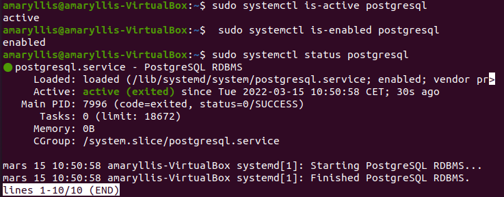
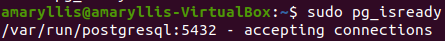
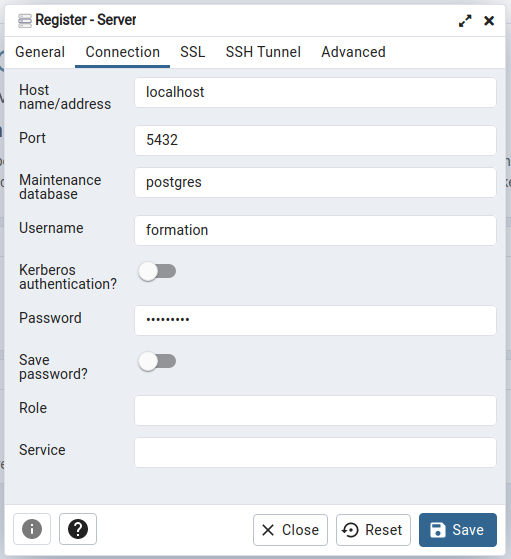

# Database Installation and Maintenance Guide #

## Architecture ##

## Install ##

In the following section we will explain how to install the database. First of all, the PostgreSQL library must be installed with the following command :
```
sudo apt install postgresql
```

Next, you need to install the pgAdmin client, an ergonomic interface for handling PostgreSQL databases :
```
sudo curl https://www.pgadmin.org/static/packages_pgadmin_org.pub | sudo apt-key add

sudo sh -c 'echo "deb https://ftp.postgresql.org/pub/pgadmin/pgadmin4/apt/$(lsb_release -cs) pgadmin4 main" > /etc/apt/sources.list.d/pgadmin4.list && apt update'

sudo apt install pgadmin4-dekstop
```

The next step is to ensure that the service is operational, active and running:
```
sudo systemctl is-active postgresql
sudo systemctl is-enabled postgresql
sudo systemctl status postgresql
```



Finally, we must ensure that the postgresql server is ready to accept connections :
```
sudo pg_isready
```



After the previous steps, we have successfully installed PostgreSQL and its client PgAdmin. However, no database is instantiated and therefore no connection to a server can be established. We will therefore create the database and the server.

```
sudo -u postgres psql
postgres=# CREATE DATABASE alegoria;
postgres=# GRANT ALL PRIVILEGES ON DATABASE alegoria to postgres;
postgres=# \q
```

Since we are handling spatial data, we also need to install the postgis extension to our database :
```
sudo apt install postgis postgresql-12-postgis-3
sudo -u postgres psql
postgres=# \c alegoria
alegoria=# CREATE EXTENSION postgis
alegoria=# CREATE EXTENSION postgis_topology;
alegoria=# \q
```

After that, you need to open the PgAdmin client and establish a connection to the server from the "Add new server" icon. This opens a window with several tabs. In the General tab, give the desired name to the server (ex: localhost). Then, in the Connection tab, connect to the server from the user created above :



Now that everything is up and running, we need to fill the database. We must ensure that python is installed with the following packages :
```
python3 --version
sudo apt-get install python3-pip 
pip install psycopg2-binary
pip install pyquaternion
```

Finally, we can complete our database with the following commands :
```
python3 create_BDD.py postgres postgres alegoria localhost 5432
```

python3 -m unittest
python3 test_create_BDD.py
## Maintenance ##