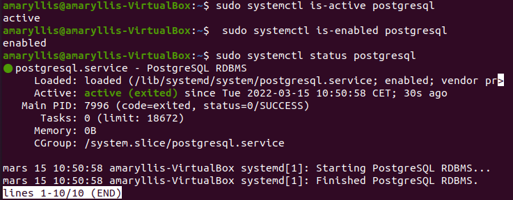
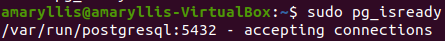
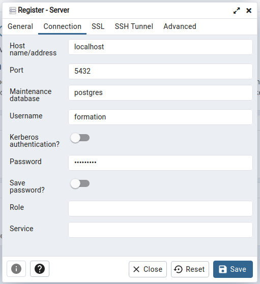

# Installation application côté client

## Pré-requis

### Côté client

```
sudo apt update
sudo apt install git nodejs npm php7.4-cli php7.4-simplexml curl
```

Il faut ensuite redémarrer le serveur apache après l'installation/mise à jour des librairies php :
```
sudo systemctl restart apache2
```

Sous Linux, dans le dossier var : 
```
sudo chmod -R 777 www
```

Si npm et node sont déjà installés, il faut les mettre à jour faire les versions les plus récentes. Pour cela il suffit de mettre à jour node, qui mettra automatiquement à jour npm:
```
curl -sL https://deb.nodesource.com/setup_16.x | sudo -E bash -

sudo apt-get install -y nodejs

node -v
npm -v 
```

### Côté serveur

Dans un premier temps, il faut installer postgresql:
```
sudo apt install postgresql
```

Dans un second temps, il faut installer le client pgAdmin :
```
sudo curl https://www.pgadmin.org/static/packages_pgadmin_org.pub | sudo apt-key add

sudo sh -c 'echo "deb https://ftp.postgresql.org/pub/pgadmin/pgadmin4/apt/$(lsb_release -cs) pgadmin4 main" > /etc/apt/sources.list.d/pgadmin4.list && apt update'

sudo apt install pgadmin4-dekstop
```

Il faut ensuite s'assurer que le service est actif et en marche :
```
sudo systemctl is-active postgresql
sudo systemctl is-enabled postgresql
sudo systemctl status postgresql
```


Enfin, on doit s'assurer que le serveur postgre est prêt à accepter des connections :
```
sudo pg_isready
```


Ensuite, il faut créer un utilisateur et une base de donnée :

**A noter que le user et le password doivent être postgres par défaut (choix du commanditaire dans ses fichiers). Le nom de la base doit être Alegoria.**
```
psql
postgres=# CREATE USER formation WITH PASSWORD 'formation';
postgres=# CREATE DATABASE alegoria;
postgres=# GRANT ALL PRIVILEGES ON DATABASE alegoria to formation;
postgres=# \q
```

Il faut également installer l'extension postgis à notre base de données. Pour cela :
```
sudo apt install postgis postgresql-12-postgis-3
sudo -u postgres psql
postgres=# \c alegoria
alegoria=# CREATE EXTENSION postgis
alegoria=# CREATE EXTENSION postgis_topology;
alegoria=# \q
```

Après cela, il faut ouvrir le client PgAdmin et établir une connexion au serveur à partir de l'icone "Add new server". Ceci ouvre une fenêtre avec plusieurs onglets. Dans l'onglet général, donné le nom souhaité au serveur (ex: localhost). Ensuite, dans l'onglet Connection, il faut se connecter au serveur à partir de l'utilisateur créé plus haut :


Il faut ensuite s'assurer que python est bien installé et installer les librairies nécessaires :
```
python3 --version
sudo apt-get install python3-pip 
pip install psycopg2-binary
pip install pyquaternion
```

Puis cloner le dépôt du serveur:
```
git clone https://github.com/mbredif/alegoria.git
git checkout TSI/tests
```

Après cela, ouvrir un terminal dans le dossier IGNF et exécuter les lignes suivantes :
```
python3 micmac2pg.py user password nomBDD localhost 5432
python3 ta2pg.py user password nomBDD localhost 5432
bash "Create_views.sh"
bash "Resolutions_scannage.sh"
```

## Construction de l'application

Ensuite téléchargement de tous les dépôts git au même niveau dans le dossier var/www/html:

https://github.com/itownsResearch/alegoria.git  
https://github.com/itownsResearch/photogrammetric-camera.git  
https://github.com/iTowns/itowns.git  

Pour itowns 2 possibilités :
1) Après avoir cloner le depot itowns, dans la dernière release (https://github.com/iTowns/itowns/releases/tag/v2.37.0) télécharger le bundle au format zip. Le deziper puis le renommer "dist". Copier coller le dossier dans le dossier itowns.

2) Télécharger le code source de la dernière release d'itowns puis compiler le projet :
A la racine vérifier la version de node soit v15.x
- Si ce n'est pas la bonne changer de version avec nvm :
`nvm use v15`
- Installer les paquets :
`npm ci`
- Preparer avant le build :
`npm run prepare`
- Verifier Linter :
`npm run lint -- --max-warnings=0`
- npm run buildBuild le bundle (dossier dist):
`npm run build`

Dans le dossier photogrammetric-camera:
- Supprimer le fichier package-lock.json
```
sudo rm package-lock.json
```
- Créer à nouveau ce fichier
```
npm install 
```
- Lancer le build
```
npm run build
```


Pour le dossier alegoria, passer sur la branche clean2. 
Donner tout les droits à certains fichiers :

```
chmod 777 data/SauvApero.xml data/test/SauvApero.xml data/test/MicMac-LocalChantierDescripteur.xml data/test/MicMac-LocalChantierDescripteurSAVE.xml
```

Après les installations ci-dessus, l'application devrait tourner sur le port localhost/alegoria

## Installation de micmac dans le dossier var/www
```
sudo apt-get install make imagemagick libimage-exiftool-perl exiv2 proj-bin qt5-default cmake build-essential
git clone https://github.com/micmacIGN/micmac.git micmac
cd micmac
mkdir build
cd build
cmake ../
make install -j(nb coeur)
```

Ouvrir le fichier bashsrc : 
```
sudo gedit /etc/bash.bashrc
```
et ajouter à la fin
```
export PATH=/micmac_install_directory/micmac/bin:$PATH
```

Pour vérifier que l'installation de micmac s'est bien déroulée :
```
mm3d
```
