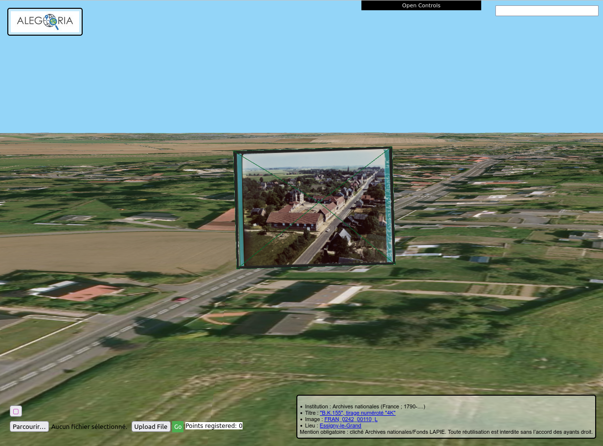

# AlegoriaDocker

This project is related to the IGN's [Alegoria-project](https://www.alegoria-project.fr/).

The call of the project is to improve the proof of concept (poc) into a deployable version of Alegoria



## Launch with docker

Before running the docker environnement you need to add all the repositories needed for the use of this project. To execute this, launch :

```
./install.sh
```

To launch the alegoria web App run :
```
docker-compose up
```

then you will need to install the database, for that in a new terminal run :
```
docker exec -it alegoriadocker_dbclient_1 /bin/bash
```
you have now acces to a commandline interface that can connect to the postgreSQL database
and all the file you need are in the `\home` directory.

To setup the database follow the instructions [here](BDD/README.md) in the `Creating the database` section

## Local launch

see : [Local-Installation Guide(depreciated)](Local-Installation.md)

